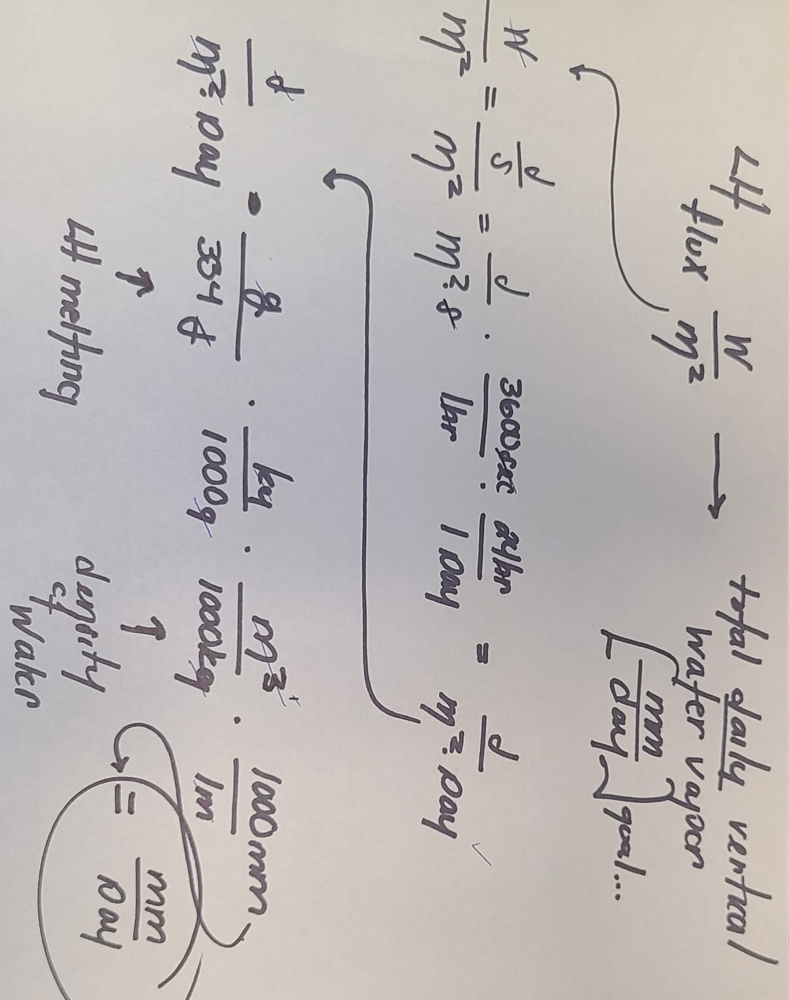

# snow-hydro
### Snow hydrology class assignments, personal research, and anaylsis. 

Author of notebooks: Cassie Lumbrazo (lumbraca@uw.edu)

Date: Spring 2023 

Class website: https://mountain-hydrology-research-group.github.io/snow-hydrology/modules/module4.html

1. What is snow? Phases and properties of matter
   * **1_PhaseChanges** notebook
2. Mass Balance: How much snow is there?
3. How does a snowpack change?
   * **2_SnowPillows** notebook
4. Mass Balance: Blowing snow, wind, and how snow smoothes landscapes
   * **4_BlowingSnowFlux** notebook
5. Radiation, albedo, and the energy balance
   * **5_EnergyBalance** notebook
6. Temperature above, below, and within the snowpack
   * **6_SnowTemperature** notebook
7. Turbulent transfer above the snow
8. What makes snow melt?
   * **8_SnowMelt notebook**
   

### Conversions required... need to convert from melt energy to energy in Watts. 

We can calculate the change in SWE in mm/day with the snow pillows, and we want to know how much energy in Watts the total daily snow melt is... 
 

Similarly, if we have the LH flux in W/m2, we can calculate the total daily verticle water vapor in mm/day

 
